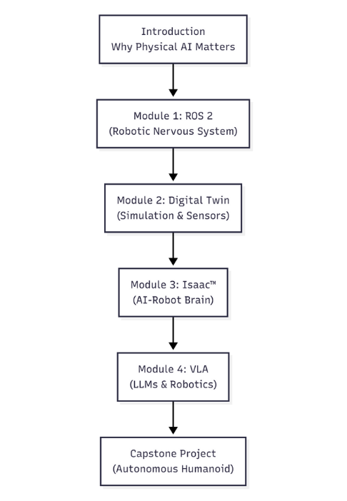

# Introduction to Physical AI & Humanoid Robotics

## Welcome to the Frontier!

Welcome, aspiring innovator, to the frontier where artificial intelligence leaps from code onto the stage of physical reality! This book is your guide to understanding and building intelligent systems that don't just process information but also perceive, interact with, and navigate our complex world. Get ready to embark on a journey that merges the power of AI with the tangible mechanics of robotics, paving the way for the next generation of humanoid machines.

This book section will guide you through the exciting world where artificial intelligence meets physical robots, especially humanoids. Whether you're an absolute beginner, an engineering student, or a developer new to robotics, this section is designed to help you understand, build, and interact with intelligent robots.

We'll start with the basics of how robots perceive their surroundings, make decisions, and move. Then, we'll dive into advanced topics like using powerful simulation tools, integrating AI brains into robots, and enabling them to understand and respond to human language. Get ready to explore step-by-step tutorials, real-world examples, and hands-on exercises that will bring the concepts to life.

## Why Physical AI Matters

Physical AI is about creating truly intelligent agents that exist and operate within the real world. This means dealing with the messiness and unpredictability of physics, gravity, friction, and dynamic objects. Unlike AI that lives purely in software, physical AI must interpret sensory data (like vision, touch, sound), make real-time decisions, and execute precise physical actions. This capability is critical for applications ranging from disaster recovery robots and surgical assistants to smart manufacturing and even space exploration. It bridges the gap between digital intelligence and physical embodiment, unlocking unprecedented possibilities.

Consider a humanoid robot designed to assist in a hospital. Without physical AI, it would struggle with unexpected obstacles, changes in patient routines, or even simply picking up a dropped item. With physical AI, the robot can perceive its surroundings using sensors like cameras (vision), interpret commands (language), plan its movements around obstacles, and safely manipulate objects (action). This convergence of AI with physical embodiment allows robots to move beyond repetitive factory tasks and become truly versatile companions and workers in human environments.

From disaster relief and space exploration to elder care and manufacturing, physical AI is transforming industries and our daily lives by creating robots that are not just tools, but intelligent, adaptable agents. Understanding this field is key to shaping the future of human-robot collaboration.

## What You'll Learn: Learning Outcomes

By the end of your journey through this book, you will gain the knowledge and practical skills to:

*   **Understand Core Concepts**: Explain fundamental principles of Physical AI, humanoid robotics, and their significance in real-world applications.
*   **Grasp the Robotic Nervous System & Navigate ROS 2**: Understand the architecture and communication protocols of ROS 2 (Nodes, Topics, Services) and how Python (rclpy) bridges to this powerful system, along with URDF for robot descriptions.
*   **Master Digital Twins & Simulate Robotic Systems**: Learn to simulate realistic robot physics and environments using Gazebo and Unity. Utilize simulation tools to model robot physics, environmental interactions, and sensor data (LiDAR, Depth Cameras, IMUs).
*   **Engage with AI-Robot Brains & Apply Advanced AI for Robotics**: Explore advanced perception and training techniques with NVIDIA Isaac™. Understand how NVIDIA Isaac Sim and Isaac ROS enable photorealistic simulation, synthetic data generation, VSLAM, and navigation for humanoid robots.
*   **Bridge Vision, Language, and Action (VLA) & Integrate VLA**: Discover how large language models (LLMs) can control robots through natural language commands. Comprehend the convergence of LLMs and robotics, including voice-to-action systems (OpenAI Whisper) and LLM-based planning (Cognit Planning).
*   **Build an Autonomous Humanoid (in simulation) & Implement Practical Solutions**: Integrate concepts from all modules to create intelligent, responsive robot behaviors. Follow step-by-step tutorials to implement basic robotic functionalities in simulation, including URDF for humanoid description and Nav2 for bipedal movement.
*   **Design Autonomous Systems**: Conceptualize and design an autonomous humanoid project, integrating various AI and robotics components to achieve complex tasks through a capstone project overview.
*   **Critically Evaluate**: Reflect on the ethical implications and future challenges of Physical AI and Humanoid Robotics.

## Who This Book Is For

This book is crafted for:

*   **Absolute Beginners:** No prior robotics or advanced AI knowledge is assumed. We start from the ground up!
*   **Engineering Students:** Supplement your theoretical knowledge with practical, hands-on simulation experience.
*   **Developers New to Robotics:** Transition your programming skills into the exciting domain of physical AI.
*   **Curious Minds:** Anyone fascinated by the future of AI and robotics and eager to understand its inner workings.

## A Little About the Modules

To give you a clearer picture of how each module contributes to building a complete understanding of Physical AI and Humanoid Robotics, here's a high-level overview of their interconnections:

    

**Description:** This diagram illustrates the progressive learning path of this book. We start with fundamental concepts in the Introduction, then build up through ROS 2 for communication, Digital Twins for simulation, NVIDIA Isaac™ for advanced AI capabilities, and finally Vision-Language-Action (VLA) for intelligent interaction, culminating in a comprehensive Capstone Project.

This book is structured into several modules, each building upon the last to give you a holistic understanding:

*   **Module 1: The Robotic Nervous System (ROS 2):** We start with ROS 2, the foundational middleware that allows different parts of a robot's software to communicate seamlessly. You'll learn about nodes, topics, services, and how Python (rclpy) bridges to this powerful system, along with URDF for robot descriptions.
*   **Module 2: The Digital Twin (Gazebo & Unity):** Next, we dive into creating virtual copies of robots and their environments. You'll explore how to simulate realistic physics, gravity, and various sensors in platforms like Gazebo and Unity.
*   **Module 3: The AI-Robot Brain (NVIDIA Isaac™):** This module introduces advanced capabilities for robot intelligence, including photorealistic simulation, synthetic data generation, and powerful navigation techniques using NVIDIA Isaac Sim and Isaac ROS.
*   **Module 4: Vision-Language-Action (VLA):** Finally, we explore the cutting edge: how large language models can interpret human commands and translate them into robot actions, culminating in a Capstone Project for an autonomous humanoid.
