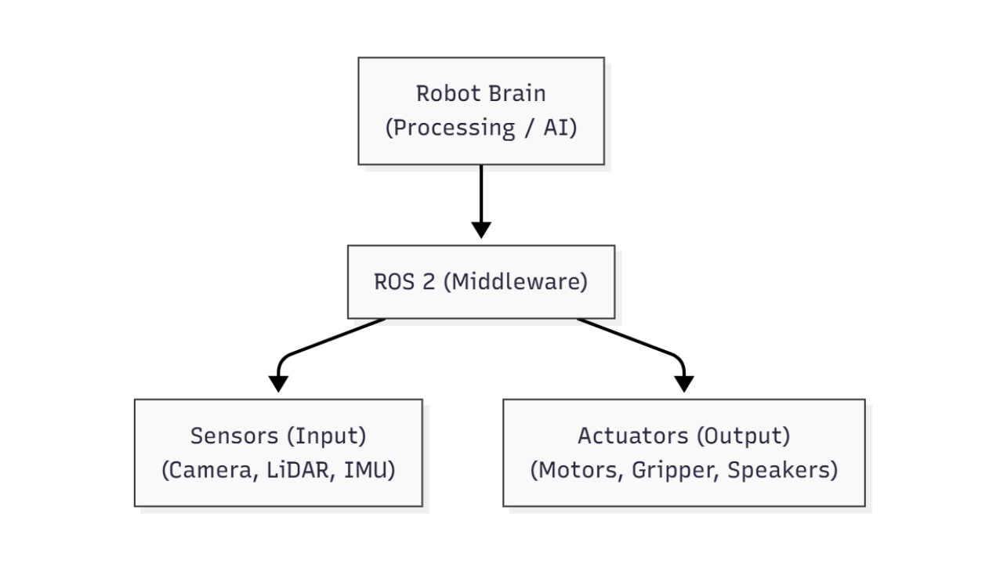

# 1.1 Introduction to ROS 2: The Robotic Middleware

## The Foundation of Modern Robotics

Welcome to Module 1, where we delve into the Robotic Operating System 2 (ROS 2), often referred to as the "nervous system" of modern robotics. Just as a human nervous system coordinates various body parts, ROS 2 provides the essential framework for different components of a robot—sensors, actuators, processing units, and software algorithms—to communicate and work together seamlessly.

To better visualize this "nervous system," consider the following simplified diagram:

 

**Description:** This diagram illustrates ROS 2 as the central communication bus (the "nervous system") connecting the robot's "brain" (processing units and AI algorithms) to its various "senses" (sensors) and "muscles" (actuators). This modularity allows for independent development and robust interaction between all robot components.

In an increasingly complex world of robotics, where diverse hardware and software need to interact efficiently, a robust middleware like ROS 2 becomes indispensable. It offers a standardized way to build, deploy, and run robotic applications, significantly streamlining the development process.

## What is ROS 2?

ROS 2 is an open-source, flexible framework for writing robot software. It's not a traditional operating system in the sense of Windows or Linux, but rather a set of software libraries, tools, and conventions that aim to simplify the task of creating complex and robust robot behaviors across a wide range of robotic platforms.

Key characteristics of ROS 2 include:

*   **Distributed Architecture:** ROS 2 allows different parts of a robot's software (called nodes) to run independently on various computers or processors, communicating over a network. This makes it highly scalable and fault-tolerant.
*   **Real-time Capabilities:** Unlike its predecessor (ROS 1), ROS 2 was designed with improved real-time performance in mind, making it suitable for applications that require precise timing and control, crucial for physical AI and humanoid robotics.
*   **Security Features:** ROS 2 includes built-in security features, allowing developers to ensure that communication between nodes is authenticated and encrypted, a critical aspect for robust and safe robot operation.
*   **Multi-platform Support:** It supports various operating systems, including Linux, Windows, and macOS, providing flexibility for development and deployment environments.

## Why ROS 2 for Humanoid Robotics?

For humanoid robots, the need for a sophisticated communication and coordination framework is paramount. Humanoids are inherently complex systems with numerous joints, sensors (vision, force, touch, IMUs), and sophisticated control algorithms that must operate in concert to achieve natural and agile movements.

ROS 2 provides:

*   **Modular Development:** It enables developers to create individual "nodes" for specific functionalities (e.g., a node for vision processing, another for gait control, one for arm manipulation, etc.). These nodes can be developed, tested, and maintained independently, simplifying the development of complex humanoid behaviors.
*   **Standardized Interfaces:** ROS 2 defines clear interfaces for communication, ensuring that different components, even if written by different teams or using different programming languages, can interoperate reliably.
*   **Rich Ecosystem of Tools:** It comes with a vast collection of tools for visualization (e.g., Rviz), debugging, data logging, and simulation, all of which are invaluable when working with the intricate dynamics of humanoid robots.
*   **Community Support:** Being open-source, ROS 2 benefits from a large and active global community, providing extensive documentation, tutorials, and support, which accelerates learning and problem-solving.

In the subsequent chapters of this module, we will explore the core concepts of ROS 2, including its communication mechanisms (Nodes, Topics, Services), how to interface with it using Python, and how to describe the physical structure of humanoid robots using URDF. This foundational knowledge will be crucial as we advance to more complex topics in physical AI and advanced robotic control.
