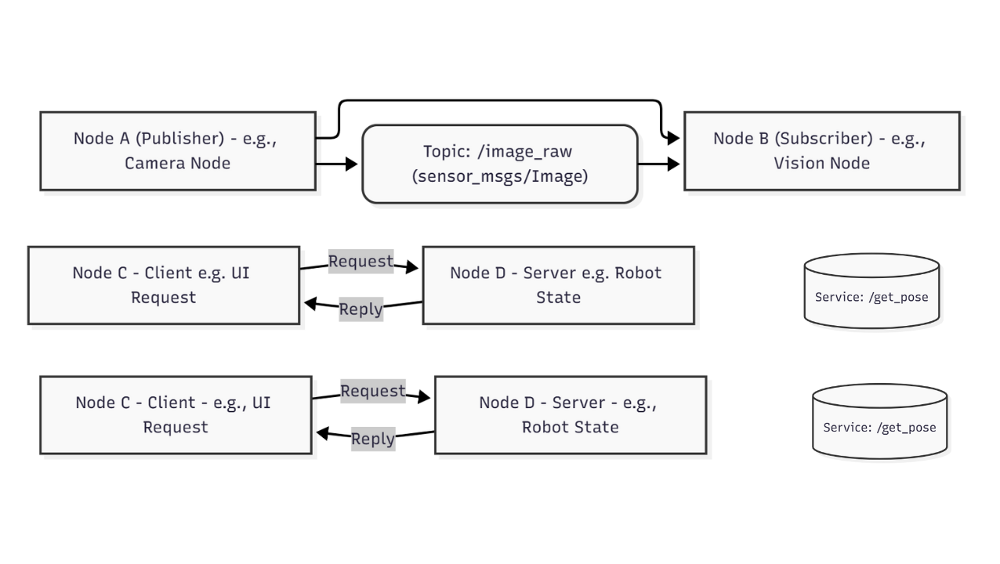

# 1.2 ROS 2 Core Concepts: Nodes, Topics, and Services

### Diagram: ROS 2 Communication Primitives

To visualize how these components interact, consider the following diagram:

 

**Description:** This diagram illustrates the three primary ROS 2 communication patterns. **Topics** enable one-to-many asynchronous data streaming (Node A publishes, Node B subscribes). **Services** provide a synchronous request-reply mechanism (Node C requests, Node D serves a response). **Actions** handle long-running, goal-oriented tasks with periodic feedback and a final result (Node E sends a goal, Node F executes and provides feedback).

## Nodes: The Executable Units

In ROS 2, a **Node** is essentially an executable process that performs a specific task. Think of a robot's overall functionality being broken down into many smaller, manageable programs, each represented by a node.

For a humanoid robot, examples of nodes might include:

*   A `camer-node` to capture and process image data.
*   A `motor_control_node` to send commands to the robot's joints.
*   A `path_planning_node` to calculate optimal movement trajectories.
*   A `human_interface_node` to manage voice commands or gesture recognition.

The beauty of nodes is their independence. Each node can be developed, debugged, and run separately. They only need to know how to communicate with other nodes, not how those other nodes are implemented internally.

## Topics: Asynchronous Data Streaming

**Topics** are the most common way for nodes to exchange asynchronous, streaming data. Imagine a publish-subscribe messaging system. A node can "publish" data to a topic, and any other node can "subscribe" to that topic to receive the data.

Key characteristics of topics:

*   **One-to-Many Communication:** A single publisher can send data to multiple subscribers, and a single subscriber can receive data from multiple publishers (though typically it's one publisher per topic).
*   **Loose Coupling:** Publishers and subscribers don't need to know about each other's existence directly. They only interact through the topic.
*   **Message Types:** Data exchanged over topics must adhere to predefined **Message Types**. These are structured data formats (e.g., `sensor_msgs/Image` for camera data, `geometry_msgs/Twist` for velocity commands) that ensure all nodes understand the information being transmitted.

**Examples in Humanoid Robotics:**

*   `camer-node` publishes `sensor_msgs/Image` messages to a topic like `/robot/camera/image_raw`.
*   `image_processing_node` subscribes to `/robot/camera/image_raw`, processes the images, and publishes object detection results to `/robot/perception/objects`.
*   `gait_control_node` subscribes to `/robot/cmd_vel` (velocity commands) to adjust the robot's walking pattern.

## Services: Synchronous Request-Reply

While topics are great for continuous, streaming data, sometimes a node needs to make a specific request and receive a direct response. This is where **Services** come in. Services provide a synchronous request-reply mechanism.

Key characteristics of services:

*   **Client-Server Model:** A node acts as a **Client** to request a service, and another node acts as a **Server** to provide the service.
*   **Blocking Call:** The client typically blocks (waits) until it receives a response from the server.
*   **Service Types:** Like message types for topics, services have **Service Types** that define the structure of both the request and the response.

**Examples in Humanoid Robotics:**

*   A `reset_pose_client` node might call a service `/robot/set_initial_pose` provided by a `robot_state_server` node to return the humanoid to a neutral stance.
*   A `diagnostics_client` might request a service `/robot/get_battery_status` from a `power_management_server` to check the battery level.

## Actions: Long-Running Goal-Based Tasks

Beyond topics and services, ROS 2 also introduces **Actions**, which are designed for long-running, goal-based tasks that can be preempted and provide periodic feedback. While not explicitly mentioned in the module overview, it's a crucial communication primitive in ROS 2 for complex robotic tasks.

*   **Goal:** A request to start a long-running task (e.g., "walk to the kitchen").
*   **Feedback:** Periodic updates on the progress of the task (e.g., "robot is 50% to the kitchen").
*   **Result:** The final outcome of the task (e.g., "robot reached the kitchen successfully").

**Example in Humanoid Robotics:**

*   A `navigation_action_client` sends a goal to a `navigation_action_server` to navigate to a specific XYZ coordinate. The server provides feedback on the robot's current position and progress, and a final result indicating success or failure.

Understanding these core communication primitives—Nodes, Topics, Services, and Actions—is essential for building any robust robotic system with ROS 2. In the next chapter, we'll explore how to implement these concepts using Python, bridging our AI agents to ROS 2 controllers.