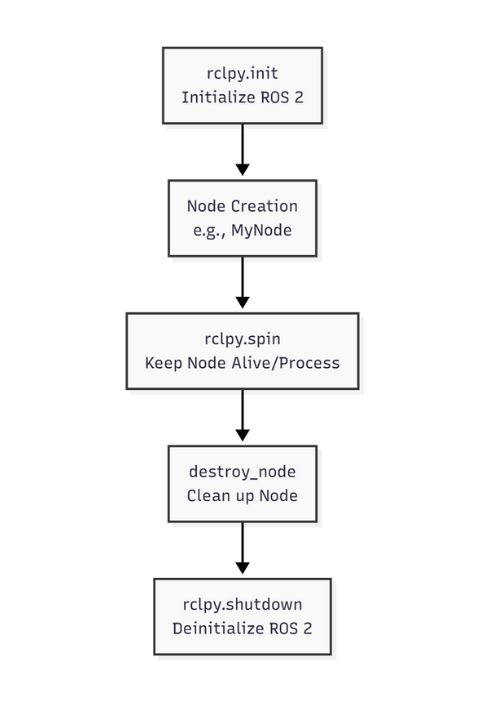

# 1.3 Bridging Python Agents to ROS 2 with rclpy

Having explored the core communication concepts of ROS 2 (Nodes, Topics, Services, and Actions), it's time to get hands-on with how we can programmatically interact with a ROS 2 system using Python. This is where `rclpy` comes in: the Python client library for ROS 2, enabling seamless integration of Python-based AI agents and control algorithms with the robotic middleware.

## Why Python for Robotics and AI?

Python has become a dominant language in AI and robotics for several compelling reasons:

*   **Readability and Simplicity:** Python's clear syntax allows for rapid development and easier understanding of complex algorithms.
*   **Rich Ecosystem:** A vast collection of libraries for AI, machine learning (TensorFlow, PyTorch), computer vision (OpenCV), and data analysis makes it ideal for developing intelligent robot behaviors.
*   **Prototyping Speed:** Its interpreted nature and dynamic typing enable quick iteration and testing of ideas, crucial in research and development.
*   **Community Support:** A large and active community provides extensive resources, examples, and support.

`rclpy` leverages these strengths, providing a robust and intuitive API for Python developers to create ROS 2 nodes, publish and subscribe to topics, call services, and interact with actions.

## `rclpy`: The Python Client Library

`rclpy` is the official Python client library for ROS 2. It wraps the core C++ ROS 2 client library (`rcl`) and provides Pythonic interfaces for all ROS 2 functionalities. This allows you to write ROS 2 nodes entirely in Python, integrating them into a larger robotic system that might also contain C++ nodes.

### Key `rclpy` Features:

*   **Node Creation:** Easily create and manage ROS 2 nodes.
*   **Publisher/Subscriber:** Implement topic-based communication to send and receive data streams.
*   **Service Client/Server:** Create synchronous request-reply interactions.
*   **Action Client/Server:** Manage long-running, goal-oriented tasks with feedback.
*   **Parameters:** Access and modify node parameters at runtime.
*   **Timers:** Schedule periodic callbacks for control loops or sensor polling.

## Basic `rclpy` Structure: A Simple Publisher-Subscriber Example

Let's consider a basic example of how Python nodes using `rclpy` would communicate. Imagine a `temperature_sensor_node` (publisher) sending temperature readings to a `display_node` (subscriber).

### 1. The Publisher Node (`temperature_sensor_node.py`)

```python
import rclpy
from rclpy.node import Node
from std_msgs.msg import Float32 # Standard message type for float data
import random

class TemperatureSensorPublisher(Node):
    def __init__(self):
        super().__init__('temperature_sensor_publisher') # Node name
        self.publisher_ = self.create_publisher(Float32, 'temperature_topic', 10) # Topic name and queue size
        self.timer = self.create_timer(1.0, self.publish_temperature) # Publish every 1 second
        self.get_logger().info('Temperature Sensor Node has started.')

    def publish_temperature(self):
        msg = Float32() # Create a new Float32 message
        msg.data = random.uniform(20.0, 30.0) # Simulate a temperature reading
        self.publisher_.publish(msg)
        self.get_logger().info(f'Publishing: "{msg.data:.2f} C"')

def main(args=None):
    rclpy.init(args=args)
    temp_publisher = TemperatureSensorPublisher()
    rclpy.spin(temp_publisher) # Keep the node alive
    temp_publisher.destroy_node()
    rclpy.shutdown()

if __name__ == '__main__':
    main()
```

*   **`rclpy.init()` and `rclpy.shutdown()`:** Initializes and cleans up the ROS 2 client library.
*   **`Node` class:** Our `TemperatureSensorPublisher` inherits from `rclpy.node.Node`, giving it all the basic ROS 2 node functionalities.
*   **`super().__init__('node_name')`:** Calls the constructor of the base `Node` class, registering our node with the ROS 2 system.
*   **`create_publisher()`:** Creates a publisher for a specific message type (`Float32`) on a given topic (`temperature_topic`) with a queue size.
*   **`create_timer()`:** Sets up a timer to call a function (`publish_temperature`) periodically.
*   **`publisher_.publish(msg)`:** Sends the message over the topic.

### 2. The Subscriber Node (`display_node.py`)

```python
import rclpy
from rclpy.node import Node
from std_msgs.msg import Float32

class DisplaySubscriber(Node):
    def __init__(self):
        super().__init__('display_subscriber')
        self.subscription = self.create_subscription(
            Float32,
            'temperature_topic',
            self.temperature_callback,
            10) # Topic name, callback function, and queue size
        self.subscription # prevent unused variable warning
        self.get_logger().info('Display Node has started.')

    def temperature_callback(self, msg):
        self.get_logger().info(f'Received: "{msg.data:.2f} C"')

def main(args=None):
    rclpy.init(args=args)
    display_subscriber = DisplaySubscriber()
    rclpy.spin(display_subscriber)
    display_subscriber.destroy_node()
    rclpy.shutdown()

if __name__ == '__main__':
    main()
```

*   **`create_subscription()`:** Creates a subscriber for a specific message type (`Float32`) on a given topic (`temperature_topic`). When a message arrives, it calls the `temperature_callback` function.
*   **`temperature_callback(self, msg)`:** This function is executed whenever a new message is received on the subscribed topic.

## Running ROS 2 Python Nodes

To run these nodes, you would typically use the `ros2 run` command after setting up your ROS 2 environment and building your Python package. The process involves creating a Python package, defining entry points in `setup.py`, and then sourcing your workspace.

### Diagram: `rclpy` Node Lifecycle

The general lifecycle of a simple `rclpy` node follows a predictable pattern:

 

**Description:** This diagram illustrates the typical sequence of operations for an `rclpy` node. `rclpy.init()` initializes the ROS 2 client library, a `Node` object is created, `rclpy.spin()` keeps the node active to process callbacks, `destroy_node()` cleans up the individual node, and `rclpy.shutdown()` deinitializes the ROS 2 client library when all nodes are done.

To run these nodes, you would typically use the `ros2 run` command after setting up your ROS 2 environment and building your Python package. The process involves creating a Python package, defining entry points in `setup.py`, and then sourcing your workspace.

This simple example demonstrates how `rclpy` allows Python programs to become integral parts of a ROS 2 robotic system. By creating publishers, subscribers, service clients/servers, and action clients/servers, Python-based AI agents can send commands to robot hardware, receive sensor feedback, and execute complex behaviors, forming the "brain" of our physical AI systems. The next chapter will focus on describing the physical structure of these robots using URDF.