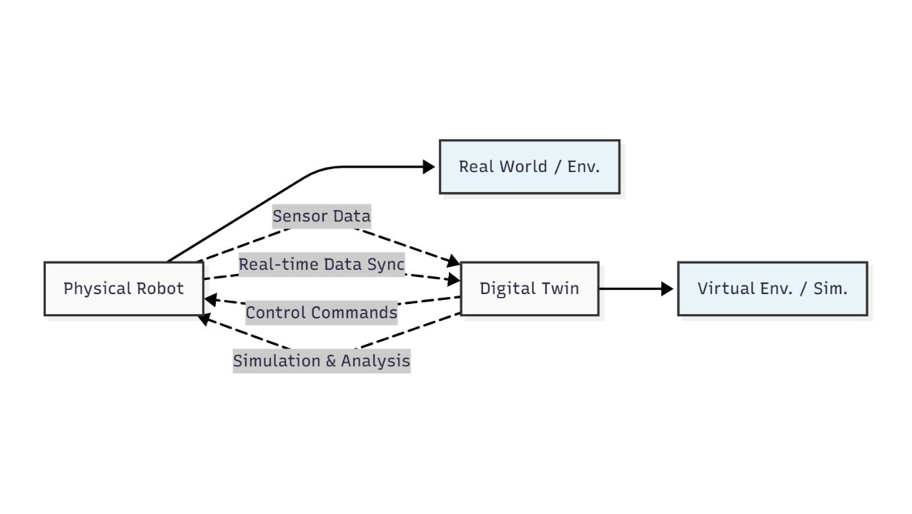

# 2.1 Introduction to Digital Twins in Robotics

Welcome to Module 2! Having established a robust communication framework with ROS 2 and described our robot's physical structure with URDF, we now move into the fascinating realm of **Digital Twins**. In the context of robotics, a digital twin is a virtual replica of a physical robot and its environment, designed to mirror its real-world counterpart as accurately as possible.

## What is a Digital Twin?

A digital twin is more than just a 3D model. It's a dynamic, virtual model of a physical object or system that is updated in real-time with data from its physical twin. This constant synchronization allows for comprehensive monitoring, analysis, and simulation of the physical entity.

### Diagram: Physical Robot and Digital Twin Interaction

 

**Description:** This diagram illustrates the core concept of a digital twin. A physical robot in the real world continuously sends sensor data to its virtual replica, the digital twin. The digital twin, residing in a simulated environment, processes this data, runs AI logic and simulations, and can then send control commands back to the physical robot, creating a powerful feedback loop for monitoring, analysis, and control.

A digital twin is more than just a 3D model. It's a dynamic, virtual model of a physical object or system that is updated in real-time with data from its physical twin. This constant synchronization allows for comprehensive monitoring, analysis, and simulation of the physical entity.

Key characteristics of a digital twin in robotics:

*   **Virtual Replica:** A detailed 3D model of the robot and its environment, including physical properties, sensors, and actuators.
*   **Real-time Data Integration:** Data from the physical robot's sensors (e.g., joint angles, force readings, camera feeds) can be fed into the digital twin, allowing it to reflect the real-world state.
*   **Simulation Capabilities:** The digital twin can be used to run simulations, test control algorithms, predict behavior, and optimize performance without risking damage to the physical robot.
*   **Bidirectional Information Flow:** Information flows from the physical world to the digital twin (monitoring) and from the digital twin back to the physical world (control and optimization).

## The Power of Simulation in Physical AI and Humanoid Robotics

For physical AI and especially humanoid robotics, simulation is not just a convenience; it's a necessity. Humanoid robots are complex, expensive, and fragile. Developing and testing control algorithms directly on hardware can be time-consuming, costly, and potentially dangerous. Digital twins, powered by realistic simulation environments, offer a safe, efficient, and scalable alternative.

### Benefits of Simulation:

*   **Reduced Development Costs:** Test algorithms, sensor configurations, and robot designs virtually before committing to expensive hardware prototypes.
*   **Accelerated Development Cycles:** Iterate rapidly on control strategies and AI models without waiting for physical hardware availability or risking damage.
*   **Safe Experimentation:** Conduct experiments in hazardous or impossible-to-replicate real-world scenarios (e.g., disaster recovery, extreme environments).
*   **Scalability:** Run multiple simulations in parallel, allowing for large-scale data generation for machine learning training (e.g., synthetic data for computer vision).
*   **Reproducibility:** Easily reproduce experiments with identical initial conditions, which is crucial for debugging and validating results.
*   **Sensor Data Generation:** Generate realistic sensor data (LiDAR, depth cameras, IMUs) that can be used to train perception algorithms even before a physical robot is built.
*   **Human-Robot Interaction (HRI) Prototyping:** Design and test human-robot interaction paradigms in a controlled virtual environment.

## Simulation Tools: Gazebo and Unity

In this module, we will primarily focus on two powerful simulation platforms:

*   **Gazebo:** A robust, open-source 3D robot simulator that accurately simulates rigid-body physics, sensor noise, and environmental interactions. It's tightly integrated with ROS 2, making it an ideal choice for robotic research and development.
*   **Unity:** A leading real-time 3D development platform known for its high-fidelity rendering capabilities and extensive tools for creating rich, interactive environments. While traditionally used for game development, Unity is increasingly adopted in robotics for its advanced visualization, human-robot interaction (HRI) prototyping, and machine learning capabilities.

Both Gazebo and Unity allow us to create "digital twins" of our humanoid robots, enabling us to test complex AI behaviors, refine control algorithms, and gather essential data in a risk-free virtual setting. In the next chapters, we will delve deeper into each of these platforms, exploring how to simulate realistic physics, build detailed environments, and integrate various sensors into our digital robots.