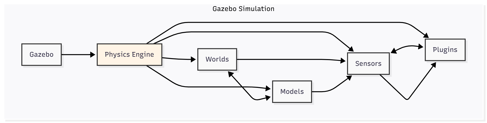

# 2.2 Gazebo: Realistic Physics Simulation

Building upon our introduction to digital twins, this chapter focuses on **Gazebo**, a powerful open-source 3D robot simulator that is a cornerstone for robotics research and development. Gazebo provides the capability to accurately simulate rigid-body dynamics, environmental interactions, and sensor data, making it an indispensable tool for testing and validating robotic systems, especially complex humanoids.

## Why Gazebo?

Gazebo stands out as a preferred simulation platform for several reasons:

*   **High-Fidelity Physics:** It uses robust physics engines (like ODE, Bullet, Simbody, DART) to accurately simulate gravity, friction, collisions, and joint dynamics, crucial for realistic robot behavior.
*   **Extensive Robot and Environment Models:** Gazebo comes with a rich library of pre-built robot models (including common humanoids) and environment assets, and it supports importing custom models (e.g., from URDF/SDF).
*   **Sensor Simulation:** It can simulate a wide range of robot sensors, including cameras (monocular, stereo, depth), LiDAR, IMUs, contact sensors, and more, complete with realistic noise models.
*   **ROS 2 Integration:** Gazebo is tightly integrated with ROS 2, allowing for seamless communication between simulated robots and ROS 2 nodes. This means your Python AI agents developed with `rclpy` can control robots in Gazebo just as they would control a physical robot.
*   **Modular Plugin Architecture:** Its plugin system allows for extending functionality, adding custom sensors, actuators, and control interfaces.
*   **Graphical User Interface (GUI):** A user-friendly interface allows for visualizing the simulation, manipulating objects, and inspecting robot properties.

## Key Components of a Gazebo Simulation

Understanding how Gazebo functions involves knowing its core components. Here's a diagram illustrating their interconnections:
 
 

**Description:** This diagram illustrates the core components of a Gazebo simulation. The **Physics Engine** drives the dynamics within **Worlds** (which define the environment) and **Models** (representing robots and objects, often from URDF/SDF). **Sensors** generate data streams from the simulated environment, and **Plugins** extend Gazebo's functionality, including bridging with ROS 2.

Understanding how Gazebo functions involves knowing its core components:

1.  **Worlds:** These define the simulation environment. A world file (typically `.world` XML format) specifies the static objects (terrain, buildings, obstacles), lighting conditions, global physics parameters (gravity, time step), and the robots to be spawned.
2.  **Models:** These represent robots or dynamic objects within the world. Robot models are often imported from URDF files (as we learned in Chapter 1.4) or directly defined using Gazebo's native SDF (Simulation Description Format).
3.  **Physics Engine:** At its core, Gazebo relies on a physics engine to calculate the movement and interactions of all objects in the simulation. This includes applying forces, resolving collisions, and simulating joint dynamics.
4.  **Sensors:** Simulated sensors generate data streams (e.g., image topics, point clouds) that mimic real-world sensor outputs. These outputs can be directly consumed by ROS 2 nodes.
5.  **Plugins:** Gazebo's functionality can be extended through plugins. For ROS 2 integration, specific plugins (e.g., `ros_gz_bridge`) are used to bridge data between Gazebo and ROS 2 topics/services.

## Setting up a Humanoid in Gazebo

To simulate a humanoid robot in Gazebo, you would typically follow these steps:

1.  **URDF/SDF Model:** Ensure you have a complete and accurate URDF or SDF description of your humanoid robot, including visual, collision, and inertial properties for all links and joints.
2.  **Gazebo World File:** Create a `.world` file that defines the environment the humanoid will operate in. This can be a simple empty world, an indoor scene, or a more complex outdoor environment.
3.  **ROS 2 Gazebo Bridge:** Utilize the `ros_gz_bridge` package to establish communication between Gazebo's simulation topics and ROS 2 topics. This is essential for sending commands to the simulated robot and receiving sensor data from it.
4.  **Control Interfaces:** Implement ROS 2 controllers (e.g., `ros2_control`) that interface with the simulated robot's joints in Gazebo. Your `rclpy` Python nodes can then send commands to these ROS 2 controllers.
5.  **Launch Files:** Use ROS 2 launch files (Python or XML) to orchestrate the startup of Gazebo, load the robot model, spawn the robot in the world, and launch necessary ROS 2 nodes and controllers.

### Example: Spawning a Humanoid (Conceptual `ros2 launch`)

```bash
# Example command to launch a humanoid in a Gazebo empty world
ros2 launch my_humanoid_description display.launch.py # This might launch rviz2
ros2 launch gazebo_ros gazebo.launch.py # This launches Gazebo empty world
ros2 launch my_humanoid_bringup humanoid_sim.launch.py # This would spawn the robot and start controllers
```

*(Note: The exact launch commands and file names will depend on your specific robot's ROS 2 package structure.)*

By leveraging Gazebo's realistic physics and robust ROS 2 integration, we gain a powerful virtual testbed for our humanoid robots. We can simulate walking gaits, object manipulation, and complex interactions with the environment, all within a safe and repeatable setting. While Gazebo excels at physics-driven simulation, the next chapter will explore Unity for high-fidelity rendering and advanced human-robot interaction.