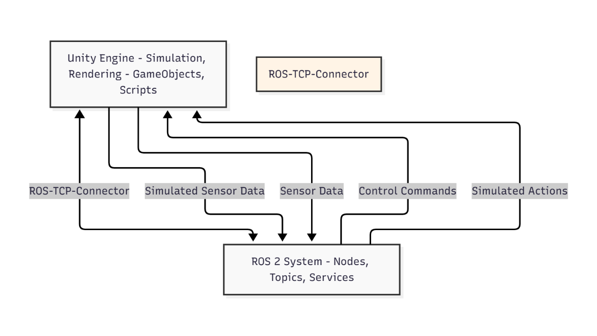

# 2.3 Unity: High-Fidelity Rendering and Human-Robot Interaction

While Gazebo excels at realistic physics simulation for robotics, **Unity** offers unparalleled capabilities in high-fidelity rendering, visual realism, and intuitive tools for designing complex human-robot interaction (HRI) scenarios. Originally a powerful game development engine, Unity has become a crucial platform for robotics, especially when dealing with advanced visualization, user experience, and AI training environments.

## Why Unity for Robotics and HRI?

Unity's strengths perfectly complement the needs of physical AI and humanoid robotics, particularly in areas where visual fidelity and human interaction are paramount:

*   **Photorealistic Rendering:** Unity's rendering pipeline (URP, HDRP) allows for creating highly detailed and visually convincing environments, making it ideal for simulating human-like perception and interaction.
*   **Rich Asset Store:** A vast marketplace of 3D models, environments, textures, and tools significantly accelerates the creation of complex simulation scenes.
*   **Interactive Environments:** Unity's event-driven architecture and scripting capabilities (C#) make it easy to design dynamic and interactive environments where robots can perform tasks and humans can provide input.
*   **Human-Robot Interaction (HRI) Prototyping:** Its intuitive UI tools and extensibility allow for rapid prototyping of human interfaces, control panels, and visualization dashboards for robot teleoperation or collaborative tasks.
*   **Machine Learning Integration:** Unity provides powerful tools like Unity ML-Agents, enabling the training of AI models directly within the simulation environment, particularly useful for reinforcement learning tasks for robot control.
*   **Cross-Platform Deployment:** Simulations built in Unity can be deployed across various platforms, from desktop applications to VR/AR headsets, offering flexible visualization and interaction options.

## Key Concepts in Unity for Robotics

When using Unity for robotics, you'll encounter several core concepts:

1.  **Scenes:** Similar to Gazebo's worlds, a Unity `Scene` is where you design and build your interactive environment. It contains all the game objects (robots, obstacles, lighting, cameras) that make up your simulation.
2.  **GameObjects:** These are the fundamental objects in Unity that represent everything in your scene. Robots, sensors, virtual humans, and environmental elements are all GameObjects.
3.  **Components:** GameObjects gain functionality by attaching `Components` to them. Examples include `Rigidbody` (for physics simulation), `Mesh Renderer` (for visual representation), `Collider` (for collision detection), and custom scripts.
4.  **Scripts (C#):** Unity primarily uses C# for scripting. You write C# scripts to define custom behaviors for your GameObjects, implement control logic, handle sensor data, and manage HRI elements.
5.  **Physics Engine (NVIDIA PhysX):** Unity integrates the NVIDIA PhysX engine for realistic physics simulation, handling collisions, rigid-body dynamics, and joint constraints, similar to Gazebo.
### Diagram: ROS 2 - Unity Integration

To bridge a Unity simulation with a ROS 2 system, specialized connectors facilitate message exchange:

 
 
**Description:** This diagram illustrates the bidirectional communication between Unity and ROS 2. The Unity engine simulates the robot and environment, generating sensor data and executing actions. The `ROS-TCP-Connector` (or similar bridge) facilitates the exchange of control commands from ROS 2 nodes to the simulated robot in Unity, and sensor data from Unity back to ROS 2 topics, enabling closed-loop control.

## Designing HRI Scenarios in Unity

Unity is particularly adept at creating rich HRI scenarios for humanoid robots:

*   **Visual Feedback:** Displaying the robot's internal state (joint angles, sensor readings, AI decision-making) in an intuitive and visually appealing manner.
*   **Teleoperation Interfaces:** Building custom dashboards or virtual reality interfaces that allow humans to control the robot's movements or specific actions in real-time.
*   **Natural Language Interaction:** Integrating speech recognition and synthesis to allow humans to give voice commands to the robot and receive verbal responses, enhancing the naturalness of interaction.
*   **Gesture Recognition:** Simulating human gestures and enabling the robot to perceive and respond to them.
*   **Scenario Authoring:** Creating complex interactive scenarios with dynamic events, where human and robot roles can be tested and refined.

## Unity for Synthetic Data Generation

Beyond HRI, Unity's high-fidelity rendering is invaluable for **synthetic data generation**. Training advanced AI perception models (e.g., for object recognition, pose estimation) often requires vast amounts of annotated data. Manually collecting and labeling this data from the real world is expensive and time-consuming.

Unity can be used to:

*   **Generate Diverse Datasets:** Create large, varied datasets of images, depth maps, and semantic segmentation masks under different lighting, weather, and environmental conditions.
*   **Automated Labeling:** Since all objects in the simulation are known, ground truth labels (bounding boxes, object IDs, pose information) can be automatically extracted.
*   **Data Augmentation:** Easily augment synthetic data with variations that would be difficult or impossible to capture in the real world.

By combining Gazebo's robust physics with Unity's visual realism and HRI tools, we can create comprehensive digital twins that serve as powerful platforms for developing and testing the next generation of physical AI systems. The next chapter will dive into the specifics of simulating various types of sensors that are critical for these digital twins.