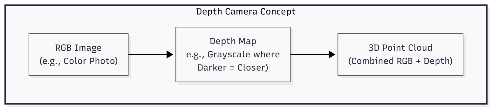
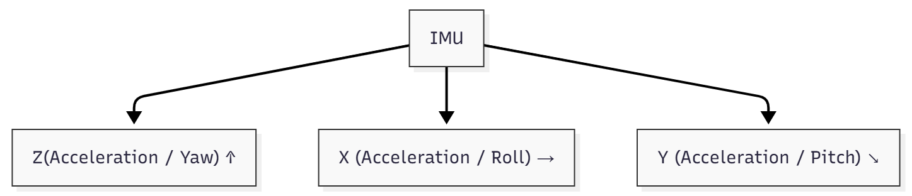

# 2.4 Simulating Robot Sensors: LiDAR, Depth Cameras, and IMUs

For a humanoid robot to perceive and interact intelligently with its environment, it relies heavily on a diverse array of sensors. In a digital twin, these sensors must be accurately simulated to provide realistic data for our AI algorithms. This chapter delves into the simulation of three critical sensor types: **LiDAR**, **Depth Cameras**, and **Inertial Measurement Units (IMUs)**.

## The Importance of Sensor Data for Physical AI

Sensor data forms the primary input for a robot's perception system. Without accurate and rich sensory information, an AI agent cannot understand its surroundings, detect objects, estimate its own pose, or plan safe movements. Realistic sensor simulation is therefore paramount for:

*   **Training Perception Models:** Generating synthetic datasets with ground truth labels for deep learning models (e.g., object detection, semantic segmentation, 3D reconstruction).
*   **Developing Localization and Mapping (SLAM):** Testing algorithms for Simultaneous Localization and Mapping (VSLAM, LiDAR SLAM) that allow robots to build maps of unknown environments while simultaneously tracking their own position.
*   **Validating Control Algorithms:** Ensuring that control systems can react appropriately to sensor feedback, especially during navigation or manipulation tasks.
*   **Debugging and Optimization:** Isolating sensor-specific issues and optimizing sensor placement, parameters, and fusion strategies.

## Simulating LiDAR (Light Detection and Ranging)

**LiDAR** sensors measure distances to objects by emitting laser pulses and calculating the time it takes for the pulses to return. They generate 2D or 3D point clouds, which are crucial for environmental mapping, obstacle detection, and navigation.

### Diagram: LiDAR Ray Casting Concept

 

```
Description: This diagram illustrates the basic principle of LiDAR simulation. Rays are cast from the LiDAR sensor, and the distance to the first object intersected by each ray is measured, forming a point cloud representation of the environment.
```

### How LiDAR is Simulated:

*   **Ray Casting:** Simulation environments like Gazebo and Unity simulate LiDAR by casting rays from the sensor's origin into the scene. The distance to the first object intersected by each ray is recorded.
*   **Parameters:** Key parameters include the number of horizontal and vertical rays, angular resolution, minimum/maximum range, and scan rate. These are configured to match real-world LiDAR units.
*   **Noise Models:** Realistic LiDAR simulation often includes noise models (e.g., Gaussian noise for distance measurements) to mimic the imperfections of physical sensors.
*   **Output:** Simulated LiDAR typically outputs a `sensor_msgs/LaserScan` (for 2D) or `sensor_msgs/PointCloud2` (for 3D) message in ROS 2, which can be processed by perception and navigation nodes.

**Application in Humanoid Robotics:** LiDAR is vital for a humanoid to map its surroundings, detect unexpected obstacles during walking, and navigate complex indoor environments.

## Simulating Depth Cameras (RGB-D Cameras)

**Depth Cameras** (also known as RGB-D cameras, like Intel RealSense or Microsoft Azure Kinect) provide both a color image (RGB) and a corresponding depth map for each pixel. This allows robots to perceive the 3D structure of their environment and estimate the distances to objects.

### Diagram: Depth Camera Output Concept

 

**Description:** This diagram shows the conceptual output of a depth camera. It produces a standard color (RGB) image and a corresponding depth map (where pixel intensity indicates distance). These two outputs can then be combined to generate a 3D point cloud of the scene.


### How Depth Cameras are Simulated:

*   **Render Textures/Buffers:** Simulation engines render the scene from the camera's perspective, generating both a color image and a depth buffer (which stores distance information for each pixel).
*   **Post-processing:** The raw depth buffer can be converted into a depth image and optionally combined with the RGB image to form an RGB-D data stream.
*   **Intrinsic/Extrinsic Parameters:** The simulated camera's intrinsic parameters (focal length, principal point) and extrinsic parameters (position and orientation relative to the robot) are accurately modeled.
*   **Output:** Simulated depth cameras typically publish `sensor_msgs/Image` messages for both RGB and depth data, along with `sensor_msgs/CameraInfo` for calibration parameters, into the ROS 2 ecosystem.

**Application in Humanoid Robotics:** Depth cameras are crucial for object recognition, 3D reconstruction of scenes, hand-eye coordination for manipulation tasks, and safely interacting with humans by understanding their proximity.

## Simulating IMUs (Inertial Measurement Units)

An **IMU** is a sensor that measures a robot's orientation, angular velocity, and linear acceleration. It typically contains accelerometers, gyroscopes, and sometimes magnetometers. IMUs are fundamental for maintaining balance, estimating robot pose, and aiding in navigation.

### Diagram: IMU Sensing Axes Concept

  

```
**Description:** This diagram illustrates the three primary axes of sensing for an IMU. Accelerometers measure linear acceleration along X, Y, and Z axes. Gyroscopes measure angular velocity (rate of rotation) around these same axes (often referred to as Roll, Pitch, and Yaw). Magnetometers (if present) measure magnetic field strength to aid in orientation estimation.
```
### How IMUs are Simulated:

*   **Physics Engine Integration:** The simulation environment's physics engine (e.g., Gazebo's ODE/Bullet, Unity's PhysX) provides the ground truth linear acceleration and angular velocity of the simulated link where the IMU is mounted.
*   **Orientation Calculation:** The orientation can be derived from the simulated link's pose data.
*   **Noise and Bias Models:** Realistic IMU simulation adds noise (random fluctuations) and bias (consistent offsets) to the ground truth data to mimic real sensor characteristics.
*   **Output:** Simulated IMUs typically publish `sensor_msgs/Imu` messages in ROS 2, containing acceleration, angular velocity, and orientation data (often as a quaternion).

**Application in Humanoid Robotics:** IMUs are essential for a humanoid robot to maintain balance during walking or complex movements, detect falls, and provide feedback for stabilization and attitude control systems.

## Integrating Simulated Sensor Data into ROS 2

In both Gazebo and Unity, plugins or specialized connectors are used to bridge the simulated sensor outputs to ROS 2 topics. This allows your Python AI agents (running `rclpy` nodes) to subscribe to these topics, process the simulated sensor data, and make intelligent decisions, just as they would with data from real physical sensors.

By carefully configuring and simulating these critical sensors, we can create highly realistic digital twins that serve as invaluable testbeds for developing and refining the perception and control systems of our physical AI and humanoid robots. This concludes Module 2. In Module 3, we will explore advanced AI-robot brains, focusing on NVIDIA Isaac™ for even more sophisticated simulation, perception, and navigation capabilities.