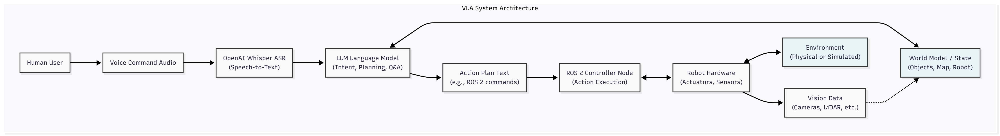
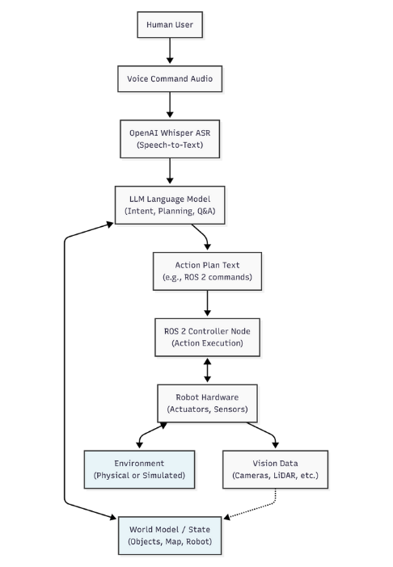

# 4.2 Vision-Language-Action (VLA) Tutorials

Welcome to the practical application of Vision-Language-Action (VLA) systems in robotics. In this module, we bridge the gap between high-level human commands and low-level robot actions. These step-by-step tutorials will guide you through integrating speech recognition with LLMs for intelligent robot control.

## Tutorial 4.2.1: Voice-to-Action with OpenAI Whisper and ROS 2

This tutorial demonstrates how to set up OpenAI Whisper for transcribing voice commands and integrate it with a simple ROS 2 action. The goal is to enable a simulated robot to respond to spoken instructions.

### Prerequisites:
*   A working ROS 2 environment (e.g., Foxy, Galactic, Humble) with `rclpy`.
*   Python 3.x and `pip`.
*   OpenAI Whisper Python package (`pip install openai-whisper`).
*   An active internet connection to download Whisper models.

### Step 1: Install OpenAI Whisper

Open your terminal and install the Whisper library:

```bash
pip install openai-whisper
```

### Step 2: Create a ROS 2 Whisper Node

We will create a Python ROS 2 node that listens for audio input, transcribes it using Whisper, and then publishes the text to a ROS 2 topic. This text can then be consumed by another node for command interpretation.

Create a new Python file, e.g., `whisper_node.py`, in your ROS 2 package (e.g., `my_robot_ws/src/vla_bringup/vla_bringup/whisper_node.py`):

```python
import rclpy
from rclpy.node import Node
from std_msgs.msg import String
import whisper
import sounddevice as sd
import numpy as np

class WhisperNode(Node):
    def __init__(self):
        super().__init__('whisper_node')
        self.publisher_ = self.create_publisher(String, 'voice_command', 10)
        self.get_logger().info('Whisper Node has been started.')

        # Load Whisper model (tiny.en is efficient for English-only and CPU)
        self.model = whisper.load_model("tiny.en")
        self.get_logger().info('Whisper model loaded.')

        # Audio recording parameters
        self.samplerate = 16000  # Whisper expects 16kHz audio
        self.duration = 5      # Record for 5 seconds

        self.timer = self.create_timer(10.0, self.record_and_transcribe) # Run every 10 seconds

    def record_and_transcribe(self):
        self.get_logger().info('Recording audio...')
        try:
            audio_data = sd.rec(int(self.samplerate * self.duration), samplerate=self.samplerate, channels=1, dtype='float32')
            sd.wait() # Wait for the recording to finish
            self.get_logger().info('Audio recorded. Transcribing...')

            # Normalize audio to Whisper's expected format
            audio = audio_data.flatten().astype(np.float32)

            result = self.model.transcribe(audio, fp16=False) # fp16=False for CPU compatibility
            command_text = result["text"].strip()

            if command_text:
                msg = String()
                msg.data = command_text
                self.publisher_.publish(msg)
                self.get_logger().info(f'Published: "{command_text}"')
            else:
                self.get_logger().info('No speech detected.')

        except Exception as e:
            self.get_logger().error(f'Error during recording or transcription: {e}')

def main(args=None):
    rclpy.init(args=args)
    whisper_node = WhisperNode()
    rclpy.spin(whisper_node)
    whisper_node.destroy_node()
    rclpy.shutdown()

if __name__ == '__main__':
    main()
```

### Step 3: Create a ROS 2 Command Interpreter Node

Now, create another Python ROS 2 node that subscribes to the `voice_command` topic, interprets the command, and prints a simulated robot action. This is where an LLM could eventually be integrated for more complex planning.

Create a new Python file, e.g., `command_interpreter_node.py` in the same ROS 2 package:

```python
import rclpy
from rclpy.node import Node
from std_msgs.msg import String

class CommandInterpreterNode(Node):
    def __init__(self):
        super().__init__('command_interpreter_node')
        self.subscription = self.create_subscription(
            String,
            'voice_command',
            self.command_callback,
            10)
        self.subscription  # prevent unused variable warning
        self.get_logger().info('Command Interpreter Node has been started.')

    def command_callback(self, msg):
        command = msg.data.lower()
        self.get_logger().info(f'Received command: "{command}"')

        if "go to kitchen" in command:
            self.get_logger().info('Simulating: Robot navigating to kitchen.')
        elif "pick up ball" in command:
            self.get_logger().info('Simulating: Robot attempting to pick up the ball.')
        elif "stop" in command:
            self.get_logger().info('Simulating: Robot stopping all actions.')
        else:
            self.get_logger().info(f'Simulating: Robot received unknown command: "{command}"')

def main(args=None):
    rclpy.init(args=args)
    command_interpreter_node = CommandInterpreterNode()
    rclpy.spin(command_interpreter_node)
    command_interpreter_node.destroy_node()
    rclpy.shutdown()

if __name__ == '__main__':
    main()
```

### Step 4: Run the Nodes

First, make sure your ROS 2 package (`vla_bringup` in this example) is sourced and built. Then, open two separate terminals:

**Terminal 1 (Whisper Node):**
```bash
ros2 run vla_bringup whisper_node
```

**Terminal 2 (Command Interpreter Node):**
```bash
ros2 run vla_bringup command_interpreter_node
```

Speak into your microphone when the Whisper node indicates it's recording. You should see the transcribed text published by the Whisper node and received/interpreted by the Command Interpreter node.

### Expected Outcome:

*   Your spoken commands will be transcribed by Whisper.
*   The `command_interpreter_node` will print simulated actions based on the received voice commands.

This tutorial provides a foundational step towards building voice-controlled robotic systems. In a more advanced setup, the `command_interpreter_node` would integrate an LLM API to perform more sophisticated cognitive planning.

## Example 4.2.1: Extending Voice Commands with LLM-like Planning

This example demonstrates how to extend the `command_interpreter_node` to handle more complex, multi-step commands, simulating how an LLM might break down high-level instructions into a sequence of robot actions.

### Modified Command Interpreter Node

Update your `command_interpreter_node.py` file with the following changes. We introduce a simple, rule-based "planner" to process commands with multiple parts.

```python
import rclpy
from rclpy.node import Node
from std_msgs.msg import String
import time # For simulating sequential actions

class CommandInterpreterNode(Node):
    def __init__(self):\
        super().__init__('command_interpreter_node')
        self.subscription = self.create_subscription(
            String,
            'voice_command',
            self.command_callback,
            10)
        self.subscription  # prevent unused variable warning
        self.get_logger().info('Command Interpreter Node has been started.')

    def execute_action(self, action_description, delay=1.0):
        self.get_logger().info(f'  Executing: {action_description}')
        time.sleep(delay) # Simulate work being done

    def command_callback(self, msg):\
        command = msg.data.lower()
        self.get_logger().info(f'Received command: "{command}"')

        if "go to kitchen and pick up the mug" in command:
            self.get_logger().info('Interpreting multi-step command: Go to kitchen, then pick up mug.')
            self.execute_action("Robot navigating to kitchen.")
            self.execute_action("Robot searching for mug.")
            self.execute_action("Robot attempting to pick up the mug.")
            self.get_logger().info('Multi-step command completed.')

        elif "find the red ball and bring it here" in command:
            self.get_logger().info('Interpreting multi-step command: Find red ball, then bring it.')
            self.execute_action("Robot navigating to search area.")
            self.execute_action("Robot using vision to locate red ball.")
            self.execute_action("Robot grasping red ball.")
            self.execute_action("Robot returning to base position.")
            self.get_logger().info('Multi-step command completed.')

        elif "go to kitchen" in command:
            self.execute_action('Robot navigating to kitchen.')
        elif "pick up ball" in command:
            self.execute_action('Robot attempting to pick up the ball.')
        elif "stop" in command:
            self.execute_action('Robot stopping all actions.')
        else:
            self.get_logger().info(f'Simulating: Robot received unknown command: "{command}"')

def main(args=None):\
    rclpy.init(args=args)
    command_interpreter_node = CommandInterpreterNode()
    rclpy.spin(command_interpreter_node)
    command_interpreter_node.destroy_node()
    rclpy.shutdown()

if __name__ == '__main__':
    main()
```

### Running the Example

1.  Save the updated `command_interpreter_node.py` file.
2.  Rebuild your ROS 2 package if necessary.
3.  Run both the `whisper_node` and the `command_interpreter_node` in separate terminals as before.
4.  Speak the new multi-step commands, such as \"Go to kitchen and pick up the mug\" or \"Find the red ball and bring it here.\"

### Expected Outcome:

*   The `command_interpreter_node` will now log a sequence of simulated actions for the multi-step commands, demonstrating a basic form of cognitive planning.
*   Each simulated action will have a slight delay, illustrating the sequential nature of robot tasks.

This example illustrates how a simple rule-based system can begin to mimic the planning capabilities of an LLM, breaking down complex instructions into a series of manageable actions. As LLMs become more sophisticated, this rule-based logic can be replaced by dynamic, context-aware planning generated by the LLM itself.

## Micro-exercises 4.2.1: Extending VLA Capabilities

These exercises are designed to deepen your understanding of VLA concepts and encourage hands-on experimentation, potentially laying groundwork for the Capstone Project.

### Exercise 1: Expanding the Command Vocabulary

**Objective:** Add more commands to the `command_interpreter_node` to increase the robot's versatility.

**Task:**
1.  Modify `command_interpreter_node.py` to recognize and simulate responses for at least **three new single-step commands**. Examples could include:
    *   "Wave hand"
    *   "Say hello"
    *   "Look left"
2.  Test your new commands by speaking them into the Whisper node.

**Verification:** Observe the logs from `command_interpreter_node` to confirm that your new commands are correctly recognized and their corresponding simulated actions are printed.

### Exercise 2: Basic Object Recognition Simulation

**Objective:** Simulate a simple vision component and integrate its "findings" into the command interpretation.

**Task:**
1.  In `command_interpreter_node.py`, introduce a simulated "vision system" that can detect a predefined set of objects (e.g., "red block", "blue cylinder"). You can represent this with a simple Python dictionary or a list of known objects.
2.  Modify the `command_callback` function to include a new multi-step command like "find the [object] and pick it up".
3.  When this command is received, the interpreter should first "simulate" detecting the object (e.g., by checking if the object is in your predefined list) before proceeding with the "pick up" action. If the object is not "found", the robot should report that.

**Verification:**
*   Test with a command like "find the red block and pick it up" and confirm the simulated detection and pickup sequence.
*   Test with an unknown object (e.g., "find the green pyramid and pick it up") and confirm the robot reports not finding it.

### Exercise 3: Incorporating Simple Dialogue

**Objective:** Enable the robot to ask a clarifying question when a command is ambiguous.

**Task:**
1.  In `command_interpreter_node.py`, add a new command scenario where the instruction is intentionally vague, e.g., "move that thing".
2.  If this vague command is received, the `command_interpreter_node` should simulate asking a clarifying question (e.g., "Which thing are you referring to?") by printing it to the console.
3.  (Optional/Advanced): If you have time, consider how you might *implement* a follow-up mechanism where the robot could then process the user's answer to the clarifying question. This would require more complex state management within the node.

**Verification:** Speak the vague command and ensure the robot prints the clarifying question.

These exercises will help you understand the fundamental challenges and opportunities in building more intelligent and interactive VLA systems for humanoid robotics.

## Real-World VLA Applications

The principles and techniques explored in this module are rapidly being adopted and researched in various real-world robotics contexts. Here are a few notable areas and examples:

*   **Warehouse Robotics (e.g., Amazon Robotics, Berkshire Grey):** While often operating in structured environments, the integration of natural language interfaces is enhancing human-robot collaboration. Operators can give high-level commands (e.g., "Stow these items in aisle 5") which are then decomposed by intelligent systems into robot-executable actions. VLA systems can help in handling exceptions or re-planning tasks based on verbal instructions.

*   **Service Robotics (e.g., Boston Dynamics' Stretch, various hospitality robots):** Robots in dynamic environments like hospitals, hotels, or homes benefit immensely from VLA. A robot assistant could respond to a voice command like "Bring me a glass of water from the kitchen" by navigating, identifying objects, and performing manipulation. Research in this area often focuses on robust speech recognition in noisy environments and natural language understanding of complex human requests.

*   **Exploration and Disaster Response (e.g., NASA JPL robots, DARPA Robotics Challenge participants):** In hazardous or unstructured environments, human operators may need to guide robots from a safe distance using natural language. VLA systems allow for more intuitive control, where a command like "Investigate that anomaly near the collapsed structure" can trigger autonomous perception, navigation, and inspection routines. The ability to ask clarifying questions and receive natural language status updates is crucial here.

*   **Humanoid Robotics Research (e.g., Agility Robotics' Digit, Sanctuary AI's Phoenix):** The ultimate goal for many humanoid robot researchers is seamless human interaction. VLA is central to this, enabling humanoids to understand and execute complex, multi-modal tasks (combining vision, language, and physical action) in human-centric environments. Projects often involve large-scale datasets and advanced LLM architectures to achieve robust real-world performance.

*   **Manufacturing and Assembly (e.g., Collaborative Robots - Cobots):** While often programmed precisely, VLA can introduce flexibility. A supervisor might verbally instruct a cobot on a new assembly variation, and the system, augmented by an LLM, could adapt its programming or suggest new sequences. This reduces re-programming time and increases adaptability on the factory floor.

These examples highlight that VLA is not just a theoretical concept but a vital component in the next generation of intelligent, adaptable, and human-friendly robotic systems.

## Diagrams: VLA System Architecture and Planning Workflows

Visualizing the flow of information and control in a Vision-Language-Action (VLA) system is crucial for understanding its complexity. Below are ASCII diagrams illustrating a generalized VLA architecture and a typical LLM-driven planning workflow.

### Diagram 1: Generalized VLA System Architecture

 

**Description:** This diagram illustrates the closed-loop nature of a VLA system. A human user's voice command is transcribed by OpenAI Whisper. The resulting text is processed by an LLM, which leverages a "World Model" (representing the robot's understanding of its environment and state) to generate an action plan. This plan is then executed by the robot's ROS 2 controller, leading to physical actions in the environment. Sensor data from the robot updates the World Model, completing the loop.

### Diagram 2: LLM-Driven Cognitive Planning Workflow

 

**Description:** This diagram details how an LLM can perform cognitive planning. Given a high-level user goal and the robot's current state, the LLM decomposes the goal into a sequence of smaller, manageable intermediate plans. Each intermediate plan can then be further refined into low-level robot-executable actions (e.g., ROS 2 primitives). This hierarchical planning allows for complex tasks to be broken down and executed effectively.

These diagrams provide a conceptual framework for the VLA systems you will build and interact with in this module and beyond.

## Summary of Vision-Language-Action (VLA) Concepts

In this module, we explored the exciting convergence of Large Language Models (LLMs) and robotics, focusing on Vision-Language-Action (VLA) systems. Key takeaways include:

*   **VLA Loop**: The fundamental concept where robots perceive (Vision), understand natural language commands (Language), and execute physical tasks (Action).
*   **LLM Enhancement**: How LLMs provide robots with semantic understanding, task planning, ambiguity resolution, and even code generation capabilities.
*   **Voice-to-Action**: Utilizing tools like OpenAI Whisper to enable intuitive voice control for robotic systems.
*   **Cognitive Planning**: Simulating how LLMs can decompose high-level human goals into executable sequences of robot actions.
*   **Real-World Impact**: The growing adoption of VLA principles in diverse fields such as warehouse automation, service robotics, exploration, and humanoid research.

This module has equipped you with both theoretical understanding and practical examples to begin building more intelligent and interactive robotic agents.

## Reflection Questions for Module 4

To solidify your understanding and encourage deeper thought, consider the following questions:

1.  **Challenges of Natural Language**: What are some of the inherent challenges in enabling robots to robustly understand and execute commands given in natural human language, especially considering ambiguity and context? How might LLMs help or hinder in addressing these?
2.  **Safety and Control**: As robots become more autonomous and responsive to high-level commands, what are the critical safety considerations? How can we ensure that LLM-driven planning does not lead to unintended or unsafe actions in a simulation-only environment?
3.  **Future of Human-Robot Interaction**: Imagine a future where VLA systems are commonplace. How might the role of human operators change? What new forms of interaction or collaboration could emerge?
4.  **Beyond Voice**: The tutorials focused on voice commands. How could other forms of human input (e.g., gestures, gaze, written instructions) be integrated into a VLA system, and what advantages might they offer?
5.  **Capstone Project Preparation**: Reflect on the Capstone Project overview. What are the most challenging aspects you anticipate in integrating vision, language, and action components into a single autonomous humanoid system? How would you approach breaking down the Capstone Project into smaller, manageable sub-tasks?

By reflecting on these questions, you can further integrate the concepts from this module and prepare for more advanced challenges in physical AI and humanoid robotics.